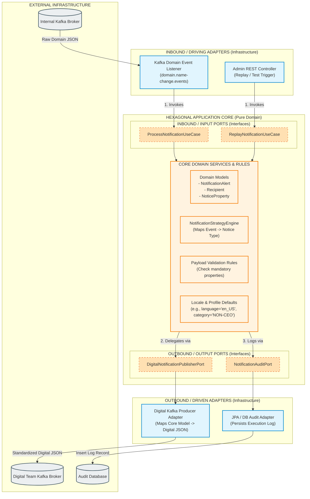

# High Level Application Design (HLD)
**System:** Alert / Notification Gateway Service  
**Architecture Pattern:** Hexagonal Architecture (Ports & Adapters)

---

## 1. Purpose & System Overview
The **Notification Gateway Service** is a dedicated integration and domain-transformation microservice. It consumes internal business domain events (from `NameService`, `AddressService`, `AdvisorService`, etc.) and converts them into the standardized, payload-heavy JSON structure required by the Digital Notification Team's Kafka topic.

It functions as an **Anti-Corruption Layer (ACL)**, shielding core domain services from the Digital Team's specific payload mechanics, generic key-value structures (`noticePropertyList`), and communication protocol details.

---

## 2. Visual High Level Design (Hexagonal Diagram)



---

## 3. Deep-Dive: Hexagonal Components Breakdown

### 3.1. What We Do Inside the **Core**
The **Core** is the center of the hexagon and represents pure application logic. **Rule:** The Core must have zero dependencies on infrastructure frameworks (no Spring annotations, no Kafka dependencies, no SQL/JPA imports).

* **Domain Model Management:** Houses framework-agnostic models like `NotificationAlert`, `NoticePropertyBag`, `ContactRole`, and `HeaderMetadata`.
* **Strategy Selection:** Uses the **Strategy Design Pattern** to determine how an incoming domain event maps to a specific Digital notice type (`NAME_CHG_TASK_ASSIGNED`, `NAME_CHG_RDY_REVIEW`, etc.).
* **Payload Normalization & Defaults:** Applies enterprise rules such as setting language defaults (`en_US`), profile categories (`NON-CEO`), and calculating request dates.
* **Property Validation:** Verifies that mandatory property values (like `requestId`, `taskId`, `firstName`) exist before dispatching.
* **Execution Orchestration:** Coordinates the flow: validating inputs, applying the strategy, building the internal notification representation, and triggering outbound ports.

---

### 3.2. What **Input (Inbound) Ports** Do
**Input Ports** are **Java Interfaces** defined inside the Core that declare *what operations the application can perform*. They act as the entry boundary to the Core.

* **Primary Function:** They define Use Case contracts (e.g., `ProcessNotificationUseCase`, `RetryFailedNotificationUseCase`).
* **Decoupling Role:** The Core does not know or care *how* a request arrived. Whether triggered by an incoming Kafka event, a REST API call, an AWS SQS queue, or a JUnit test, the trigger calls the same Input Port interface.
* **Control Boundary:** Input Ports enforce strict input parameters (commands/DTOs) ensuring no infrastructure-specific objects enter the Core logic.

#### Example Input Port Interface:
```java
public interface ProcessNotificationUseCase {
    void process(NotificationCommand command);
}
```

---

### 3.3. What **Output (Outbound) Ports** Do
**Output Ports** are **Java Interfaces** defined inside the Core that declare *what external services the Core requires to complete its job*.

* **Primary Function:** They define abstract contracts for external side-effects (e.g., `DigitalNotificationPublisherPort`, `NotificationAuditPort`).
* **Decoupling Role:** The Core calls these interfaces without knowing how the output will be handled. The Core says: *"Publish this notification alert object"*, and leaves the mechanism to the adapter.
* **Pluggable Infrastructure:** Outbound ports allow swapping infrastructure without changing business logic. For unit testing, a Mock implementation is injected; in production, a Kafka Producer implementation is injected.

#### Example Output Port Interface:
```java
public interface DigitalNotificationPublisherPort {
    void publish(NotificationAlert alert);
}
```

---

## 4. Summary of Data Flow Execution

1. **Ingestion (Inbound Adapter):** `DomainEventKafkaListener` receives an internal event from `domain.name-change.events`.
2. **Translation to Command:** The adapter converts the Kafka message into a `NotificationCommand` object.
3. **Core Entry (Input Port):** The adapter calls `ProcessNotificationUseCase.process(command)`.
4. **Core Processing (Domain Logic):**
   * Selects `NameChangeTaskAssignedStrategy`.
   * Formats properties (`requestId`, `taskId`, `entityName`, `browserViewLink`).
   * Validates mandatory fields.
   * Constructs pure `NotificationAlert` domain model.
5. **Outbound Invocation (Output Port):** Core calls `DigitalNotificationPublisherPort.publish(alert)`.
6. **Delivery (Outbound Adapter):** `DigitalKafkaProducerAdapter` converts `NotificationAlert` into the exact Digital JSON format (with `header`, `feature`, `profile`, `contact`, and `noticePropertyList`) and produces it to `digital.notifications` Kafka topic.