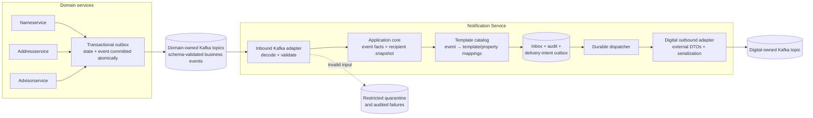

# Notification Service Architecture

**Status:** Proposed design based on incomplete inputs  
**Audience:** Domain teams, Notification Service team, Digital integration team, platform, security, operations  
**Related design:** [Detailed design](./notification_service_detailed_design.md)

## Executive summary

The Notification Service is a dedicated microservice and bounded context that consumes business events and owns the translation to customer-notification deliveries. Domain services publish template-agnostic business events and never build or publish Digital messages. The Notification Service chooses a template, format, and channel; it never decides whether a business event occurred or whether someone should be contacted. Domain services use transactional outboxes, and the Notification Service persists an inbox, audit outcome, and delivery intent before acknowledging an input record. At-least-once delivery is assumed on every hop, so inbox uniqueness and stable delivery identities prevent duplicate logical work; duplicates at the external boundary remain possible if Digital does not support idempotency. The external wire contract is isolated in the Digital outbound adapter and its catalog. This design uses Java 21, Spring Boot 3, Spring Kafka, Kafka Schema Registry, PostgreSQL, and Kubernetes as illustrative technologies only.

## Assumptions and missing inputs

| Missing input | Assumption pending confirmation |
|---|---|
| Domain services | Nameservice, addressservice, and advisorservice, based on examples in earlier drafts. |
| Stack | Java 21, Spring Boot 3, Spring Kafka, Schema Registry, PostgreSQL, Kubernetes. |
| NFRs | No throughput, latency, retention, availability, RPO/RTO, or compliance targets were supplied. |
| Payload fixtures | No Digital sample messages were supplied. The repository's `Sample.txt` is unrelated interview-preparation material. |
| Template/event inventory | Earlier drafts mention `NAME_CHG_TASK_ASSIGNED`, `NAME_CHG_RDY_REVIEW`, and `NAME_CHANGE_COMPLETED`; these are provisional examples only. |
| Recipient authority | The producing domain supplies the intended recipient snapshot and remains responsible for its business eligibility decision. |

The template names and wire-property examples in this document are placeholders, not confirmed Digital contract values. No defect in actual sample messages can be asserted until real, approved fixtures and the contract are provided.

## Context and scope

The service receives business facts from domain-owned event streams, applies Notification Service-owned mapping configuration, and dispatches a notification through an outbound channel adapter. Its bounded context includes notification planning, rendering policy, delivery intent, retry, audit, and operations.

The service does not own domain state, decide whether a business event occurred, decide whether a person should be contacted, choose recipients by applying business rules, or resolve missing business facts through implicit domain-service lookups. Missing or invalid facts become explicit audited failures; the service does not infer them.

**Scope guardrail:** domain services own event truth and intended recipients. The Notification Service owns only the transformation and delivery of a valid event. Adding a template for an existing event should be a catalog/configuration change and should not require a domain-service release.

## Architecture



### Components and ownership

| Component | Owns | Does not own |
|---|---|---|
| Domain service | Domain event meaning, event schema, business facts, intended recipients, transactional outbox | Digital templates, Digital field names, external envelope |
| Domain event topic | Durable transport for domain-owned facts; access policy and retention classification | Notification mapping or customer contact decision |
| Notification Service core | Application orchestration, event validation decisions, intent lifecycle, delivery state transitions | Kafka APIs, persistence framework, Digital DTOs |
| Notification catalog | Event-to-notification rules, target templates, property mappings, constants, allowlisted formatting, catalog version | Business eligibility, hidden domain rules, executable scripts |
| Notification persistence | Inbox/deduplication, audit ledger, delivery-intent outbox, attempt state | Unbounded raw-payload archive |
| Digital outbound adapter | External envelope, exact external spellings/types, serialization, producer configuration | Domain event semantics |
| Digital team | Destination contract and downstream processing | Domain event ownership |

## Event topics and ordering

Domain teams own their Kafka topics, schema subjects, producer ACLs, event retention classification, and event contracts. Prefer one topic per bounded context or stable event family, rather than one topic per event type, unless operational or access boundaries require otherwise. Notification Service owns its consumer groups, retry operations, quarantine path, and delivery-intent store. Digital owns the outbound destination topic and its schema/contract.

Use `source + aggregate.type + aggregate.id` as the partition key. This gives ordering within a partition for an aggregate, subject to the producer publishing records in order. It does not give global ordering, ordering across topics, or a safe ordering guarantee across a partition-count change. Include a monotonic aggregate version where the domain can supply it. Use that version to detect stale records or gaps; do not silently discard or reorder events. Where a use case truly requires per-aggregate notification ordering, hold later versions until a gap is resolved or route the sequence to an operational exception path.

Partition count, retention, and capacity must be selected only after volume, replay, and latency targets are agreed. Changing partition counts can change key-to-partition assignment and should be treated as an ordering-impacting operational event.

## Durable processing and delivery

### Producer outbox

Each domain service commits its business state change and an outbox row in one local database transaction. A relay publishes the outbox row and marks it published after broker acknowledgement. If the relay fails after publish but before marking, it republishes; the event keeps the same `eventId`. This prevents the dual-write case where domain state commits but its event is lost, at the cost of relay operations, outbox storage, and cleanup.

### Notification Service inbox and intent

For each input record, the Notification Service validates the registered schema and processes it in a database transaction:

1. Insert the inbox identity `(source, eventId)` with a uniqueness constraint.
2. Resolve and validate the catalog rule(s).
3. Write the audit state and durable delivery intents.
4. Commit the database transaction.
5. Commit the Kafka offset only after the durable result exists.

If a record is redelivered after the database commit, inbox uniqueness prevents another logical intent. If mapping or input validation fails, persist the failure and quarantine/audit result before committing the offset. If persistence fails, do not acknowledge the Kafka record.

### Outbound dispatcher and delivery guarantee

The dispatcher reads durable pending intents, sends through the Digital adapter, and records each attempt and outcome. Persist the intent and audit state before publishing. A Kafka broker acknowledgement proves broker acceptance only; it does not prove an email was received or read.

There is no atomic transaction spanning the Notification Service database and an external Digital Kafka cluster. A crash after Digital accepts a record but before the local status update can cause a duplicate. A stable delivery identity should be sent to Digital if the contract supports it. If Digital cannot deduplicate, record this as a residual at-least-once risk and explicitly handle ambiguous outcomes; never label broker acceptance as end-recipient delivery.

Recommended identity:

```text
SHA-256(source | eventId | recipientId | notificationRuleId | channel)
```

The identity differentiates multiple rules, recipients, or channels for one event. Pin the catalog version used when an intent is planned; retries must not silently render with a newer catalog. Operator-requested resends are separately audited attempts linked to the original delivery.

## Retry, error classification, and quarantine

| Class | Examples | Handling |
|---|---|---|
| Transient infrastructure | Broker unavailable, timeout, throttling, temporary network or database failover | Bounded exponential backoff with jitter; preserve intent and identity; alert on attempt count/age. |
| Permanent event failure | Unknown event type/version, malformed event, missing required business fact, invalid recipient snapshot | Persist safe failure classification and quarantine; do not retry unchanged data indefinitely. |
| Catalog/configuration failure | Missing mapping, incompatible path type, unresolved environment value, invalid formatter | Fail startup/CI for static catalog defects. Unknown runtime event types are audited, quarantined, and alerted. |
| Digital contract rejection | Payload rejected as invalid | Stop blind retries; preserve safe response metadata; fix mapping/contract and replay with explicit audit. |
| Ambiguous send outcome | Timeout after producer send may have reached Digital | Retry with same identity only where receiver deduplication exists; otherwise expose duplicate risk for controlled operations. |

For input that cannot be decoded, persist at least the source topic/partition/offset, payload hash, schema/decoder failure code, and timestamp before source offset commit. Store an encrypted raw record only when replay requirements justify it and an approved retention/access policy exists. Raw payloads and exception messages must never be written to ordinary logs.

The quarantine path is restricted operational data, not a place for indefinite retention. It needs alerting, ownership, retention, replay tooling, and an explicit disposition workflow.

## Audit, replay, and operational visibility

The audit ledger records event identity, source, schema version, aggregate identity/version, correlation ID, catalog version, rule ID, recipient reference, delivery identity, state transitions, attempt timestamps, outcome, and safe failure code. Avoid duplicating raw PII into audit rows. If a raw or rendered payload must be retained for approved replay, encrypt it, strictly limit access, and apply an explicit expiry.

Allowed delivery state examples are `PLANNED`, `RETRY_PENDING`, `ACCEPTED_BY_BROKER`, `PERMANENT_FAILURE`, and `AMBIGUOUS`. State names must not imply downstream email delivery unless Digital provides that signal.

Replay is an audited operator action with identity, reason, original delivery link, mapping version choice, and dry-run option. It must pass through normal validation and idempotency checks. Replaying an event with its original identity does not automatically authorize a second send; a deliberate resend gets a new attempt identity linked to the original.

Propagate `eventId`, `correlationId`, `causationId`, trace context, Kafka topic/partition/offset, and delivery identity through structured logs/traces. Do not attach names, addresses, or raw payloads to logs, traces, or metric labels. Use low-cardinality labels such as source service, event type, rule, and failure class.

Minimum operational signals:

* Consumer lag and oldest unprocessed input age.
* Oldest pending delivery intent and outbox age.
* Counts and rates by safe delivery state and failure class.
* Retry attempts and age distribution.
* Mapping/configuration failures and quarantine growth.
* Digital producer failures and ambiguous outcomes.
* End-to-end event-to-broker-acceptance latency.
* Audit database health and persistence failures.

Alert thresholds and SLOs cannot be set responsibly until the missing NFRs are confirmed.

## PII and regulated-data controls

Recipient addresses and names are PII. Every service and transport that carries them must use service identities and least-privilege ACLs, encryption in transit and at rest, approved retention, and audited access. Prefer tokenization or field-level encryption where practical. Minimize recipient attributes and event facts to those needed for the notification. Do not include them in logs, metric labels, traces, or exception text. Restrict quarantine, audit, and replay access separately from routine support access. Define key rotation, deletion, backup retention, and replay authorization before production.

These controls add key-management, operational, and support complexity. They are required because the same durable event/outbox design that improves recoverability also creates additional PII copies.

## Schema and contract evolution

Every domain event schema is defined and versioned by its bounded context owner, registered under that service's schema subject, and validated in producer CI and at the Notification Service ingress. Adopt backward-transitive compatibility as a baseline where supported. Add optional fields compatibly; do not change the meaning of an existing field. Breaking semantic changes require a new event type or major schema version and a migration plan.

Catalog CI checks that each configured source path exists in the event schema and that source types are compatible with mappings. The Notification Service tolerates unknown optional inbound fields but fails safely for unknown types or incompatible required values.

The Digital contract is isolated and versioned in the outbound adapter. Maintain approved contract fixtures and contract tests. Pin the outbound schema/contract version where possible and coordinate breaking changes with Digital. Record catalog and contract versions in the audit ledger. Do not let external contract names leak into event schemas or domain code.

## Architecture Decision Record

**Title:** Business-event-driven Notification Service  
**Status:** Accepted

### Context

Domain services currently build/publish external notification messages at multiple workflow points. That creates a direct dependency on an externally owned contract and spreads delivery mechanics across bounded contexts.

### Decision

1. Customer notifications are handled by a dedicated Notification Service, deployed as its own microservice and modeled as its own bounded context. Domain services no longer build or publish Digital messages.
2. Domain services publish template-agnostic business events stating what happened and who is involved. They never reference Digital template codes, Digital property names, or the Digital envelope. The Notification Service owns mapping business events to external templates and properties.

### Consequences

Domain services must publish complete, appropriately minimized facts and intended recipients using transactional outboxes. The Notification Service becomes responsible for mapping configuration, durable intent, dispatch, retries, and audit. Template changes can be isolated from domain deployments. PII flows through additional storage and transport and needs strict access, encryption, minimization, retention, and audit controls. At-least-once delivery may produce duplicates at the external boundary unless Digital provides idempotency.

### Alternatives considered

The two decisions above are fixed constraints for this design and are not re-evaluated here.

## Risks and open questions

| Risk | Likelihood | Impact | Mitigation |
|---|---|---|---|
| Actual Digital requirements differ from provisional examples | High until fixtures are supplied | Incorrect or failed notices | Obtain authoritative schemas, template property rules, and fixtures; validate with shadow rendering before cutover. |
| Ambiguous producer timeout yields a duplicate external message | Medium | Duplicate customer communication | Stable delivery identity; request receiver deduplication/status lookup; operationally reconcile ambiguous results. |
| PII is copied into logs or over-retained | Medium | High privacy/compliance impact | No payload logging; encryption and access controls; minimize, classify, and expire copies; audit access. |
| Event facts are insufficient for present/future templates | Medium | Added coupling and domain releases | Schema review, catalog path checks in CI, factual snapshot design, and shadow comparison. |
| Outbox/intent backlog grows undetected | Medium | Delayed customer notices | Alert on oldest item age and lag; capacity test; define recovery/on-call ownership. |

| Open question | Answer owner | Blocks |
|---|---|---|
| What are the complete domain services and nameservice trigger points? | Domain owners | Event inventory and migration scope |
| What are the authoritative message fixtures, template list, and required-property schemas? | Digital and product/domain owners | Verified catalog and payload review |
| Who is authoritative for recipient selection, contact address, locale, and consent? | Domain, profile, compliance owners | Recipient contract and PII data flow |
| What volume, latency, retention, availability, RPO/RTO targets apply? | Product, SRE, compliance | Capacity, partitioning, and SLO design |
| Does Digital deduplicate, expose delivery status, or support callbacks? | Digital | Ambiguous send recovery |
| What registry formats/compatibility policy and PII controls are mandatory? | Platform, security, privacy | Implementation and production readiness |

## Challenges to fixed decisions

None identified from the available evidence. The concrete residual risk is duplicate delivery after an ambiguous outbound acknowledgement; it is a boundary-delivery limitation, not evidence that either fixed decision fails. Mitigate with stable delivery identity, receiver-side deduplication or status lookup where available, and audited handling of ambiguous outcomes.
