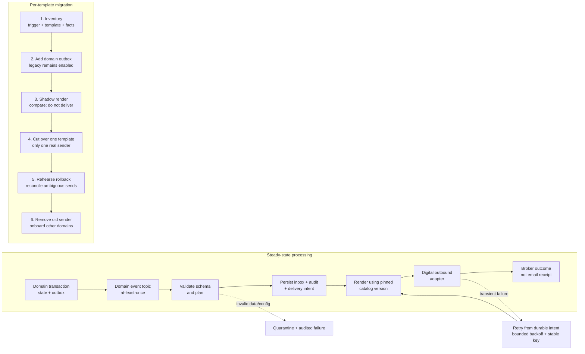

# Notification Service Detailed Design

**Status:** Proposed design based on incomplete inputs  
**Related architecture:** [Architecture](./notification_service_architecture.md)  
The architecture and migration diagrams are embedded as Mermaid in this document and in the [architecture document](./notification_service_architecture.md).

## 1. Inputs and assumptions

The requested service list, stack, NFRs, sample outbound messages, and complete template/event mapping were placeholders or absent. The repository's `Sample.txt` is unrelated interview-preparation material, not a Digital payload sample. Earlier drafts mention three template labels; these are used as clearly provisional examples and must be replaced or confirmed by the Digital owner.

| Input | Working assumption |
|---|---|
| Domain services | Nameservice, addressservice, advisorservice |
| Stack | Java 21, Spring Boot 3, Spring Kafka, Kafka Schema Registry, PostgreSQL, Kubernetes |
| Recipient responsibility | Producer supplies intended recipient(s) and contact snapshot; notification service does not decide eligibility |
| Delivery semantics | At-least-once on each hop |
| Template inventory | `NAME_CHG_TASK_ASSIGNED`, `NAME_CHG_RDY_REVIEW`, `NAME_CHANGE_COMPLETED` as unverified examples only |

## 2. Bounded context and responsibility boundary

The Notification Service owns notification planning, template selection, mapping, formatting, channel selection, durable delivery intent, retry state, audit, and operational replay. It owns no business decision about whether a name/address/advisor event happened or whether a customer/employee should be contacted.

The domain event is the authoritative statement of fact and intended recipients. The Notification Service validates that the facts and recipient snapshot meet the configured contract; it must reject and audit incomplete data rather than infer missing facts or query a domain service as a hidden fallback. Consent, eligibility, and recipient expansion belong to the responsible business domain or approved customer-contact policy owner.

## 3. Canonical event contract

The same envelope semantics apply to all domain services. Register each event's `data` schema separately under the owning domain service. JSON below is illustrative; use the organization's selected registry format in production.

```json
{
  "eventId": "0192f00a-0000-7000-8000-000000000001",
  "eventType": "nameservice.NameChangeCompleted",
  "schemaVersion": 1,
  "source": "nameservice",
  "occurredAt": "2026-10-08T18:00:00Z",
  "publishedAt": "2026-10-08T18:00:02Z",
  "aggregate": {
    "type": "NameChange",
    "id": "nc-48291",
    "version": 7
  },
  "correlationId": "case-19302",
  "causationId": "cmd-82013",
  "traceparent": "00-<trace-id>-<parent-id>-01",
  "locale": "en-IN",
  "recipients": [
    {
      "recipientId": "party-771",
      "role": "customer",
      "deliveryAddress": "<encrypted-or-tokenized-value>",
      "locale": "en-IN"
    }
  ],
  "data": {
    "nameChangeId": "nc-48291",
    "completedAt": "2026-10-08T17:59:00Z",
    "previousName": { "given": "Asha", "family": "Rao" },
    "newName": { "given": "Asha", "family": "Iyer" }
  }
}
```

| Field | Purpose |
|---|---|
| `eventId` | Stable, globally unique deduplication identity across producer retries. Do not reuse it for separate events. |
| `eventType`, `schemaVersion` | Domain meaning and schema identity, independent of notification templates. |
| `source` | Owning producer, schema namespace, access-control and support attribution. |
| `occurredAt`, `publishedAt` | Business time and broker-publication time for audit and latency diagnosis. |
| `aggregate` | Aggregate identity and monotonic version support partition ordering and gap/staleness detection. |
| `correlationId`, `causationId`, `traceparent` | Link request, command, and distributed trace; none replaces the event ID. |
| `locale` | Default locale; an individual recipient's locale overrides it. |
| `recipients` | Producer-supplied intended recipients and minimal contact snapshot. No recipient selection by Notification Service. |
| `data` | Immutable business facts needed to render without re-querying mutable domain state. |

### Event data rules

1. Carry business facts, not only identifiers. A completed name change includes old/new name values and completion time, rather than only a change ID.
2. Include facts that are reasonably reusable across template variations: before/after values, effective/completion time, relevant status, and safe display values.
3. Do not include external templates, destination property names, external envelope fields, or vendor-specific formatting instructions.
4. Minimize the snapshot: do not include an entire customer profile. Every PII field needs a purpose, classification, retention, and access policy.
5. Include the producer-determined recipient list with stable identity, business role, contact address/token, and locale when known. Notification Service validates format/presence, not eligibility or consent.
6. Do not rely on Notification Service lookups to reconstruct facts. If a fact is missing, fail explicitly and feed the producer/schema correction process.

### Event names, ownership, and evolution

Use names in each domain's ubiquitous language, in past tense, expressing a completed fact: `NameChangeCompleted`, `AddressUpdated`, `AdvisorAssigned`. Use an owning namespace such as `nameservice.NameChangeCompleted`; avoid names that describe notification actions.

The domain team defines and versions its event schema. A central governance process reviews envelope changes, PII classification, naming collisions, and compatibility, without taking ownership of domain meaning. Register schemas under domain-owned subjects; validate producers in CI and validate at ingress. Use backward-transitive compatibility as baseline where supported. Add optional fields safely and do not repurpose existing meanings. Meaning-breaking changes require a new event type or major schema version and a migration plan. Catalog field paths are checked against registered schemas in CI and at service startup.

## 4. Provisional domain event examples

The following are examples inferred from earlier drafts only; they are not verified triggers or a complete template inventory.

### `NameChangeTaskAssigned`

```json
{
  "eventId": "evt-1001",
  "eventType": "nameservice.NameChangeTaskAssigned",
  "schemaVersion": 1,
  "source": "nameservice",
  "occurredAt": "2026-10-08T18:00:00Z",
  "publishedAt": "2026-10-08T18:00:01Z",
  "aggregate": { "type": "NameChange", "id": "nc-48291", "version": 3 },
  "correlationId": "case-19302",
  "causationId": "cmd-82013",
  "locale": "en-IN",
  "recipients": [{
    "recipientId": "employee-52",
    "role": "assignedReviewer",
    "deliveryAddress": "<protected-value>",
    "locale": "en-IN"
  }],
  "data": {
    "nameChangeId": "nc-48291",
    "taskId": "task-7702",
    "assignedAt": "2026-10-08T17:59:00Z",
    "assigneeDisplayName": "Ravi Shah",
    "customerDisplayName": "Asha Rao",
    "browserViewLink": "https://approved.example/cases/nc-48291"
  }
}
```

### `NameChangeReadyForReview`

```json
{
  "eventId": "evt-1002",
  "eventType": "nameservice.NameChangeReadyForReview",
  "schemaVersion": 1,
  "source": "nameservice",
  "occurredAt": "2026-10-08T18:10:00Z",
  "publishedAt": "2026-10-08T18:10:01Z",
  "aggregate": { "type": "NameChange", "id": "nc-48292", "version": 5 },
  "correlationId": "case-19303",
  "locale": "en-IN",
  "recipients": [{
    "recipientId": "employee-53",
    "role": "reviewer",
    "deliveryAddress": "<protected-value>",
    "locale": "en-IN"
  }],
  "data": {
    "nameChangeId": "nc-48292",
    "taskId": "task-7703",
    "readyAt": "2026-10-08T18:09:00Z",
    "customerDisplayName": "Neha Das",
    "browserViewLink": "https://approved.example/cases/nc-48292"
  }
}
```

### `NameChangeCompleted`

```json
{
  "eventId": "evt-1003",
  "eventType": "nameservice.NameChangeCompleted",
  "schemaVersion": 1,
  "source": "nameservice",
  "occurredAt": "2026-10-08T18:20:00Z",
  "publishedAt": "2026-10-08T18:20:01Z",
  "aggregate": { "type": "NameChange", "id": "nc-48291", "version": 7 },
  "correlationId": "case-19302",
  "locale": "en-IN",
  "recipients": [{
    "recipientId": "party-771",
    "role": "customer",
    "deliveryAddress": "<protected-value>",
    "locale": "en-IN"
  }],
  "data": {
    "nameChangeId": "nc-48291",
    "completedAt": "2026-10-08T18:19:00Z",
    "previousName": { "given": "Asha", "family": "Rao" },
    "newName": { "given": "Asha", "family": "Iyer" }
  }
}
```

## 5. Hexagonal application design

### Package/module layout

```text
notification-service/
  notification-domain/
    src/main/java/com/example/notification/domain/
      BusinessEvent.java
      EventIdentity.java
      RecipientSnapshot.java
      NotificationIntent.java
      DeliveryIdentity.java
      DeliveryStatus.java
  notification-application/
    src/main/java/com/example/notification/application/
      AcceptBusinessEventService.java
      DispatchPendingDeliveriesService.java
      port/in/
      port/out/
  notification-adapter-kafka-in/
    src/main/java/com/example/notification/adapter/in/kafka/
      BusinessEventKafkaListener.java
      RegisteredEventDecoder.java
  notification-adapter-persistence/
    src/main/java/com/example/notification/adapter/out/persistence/
      InboxRepository.java
      DeliveryOutboxRepository.java
      AuditRepository.java
  notification-adapter-digital/
    src/main/java/com/example/notification/adapter/out/digital/
      DigitalPayloadMapper.java
      DigitalKafkaDeliveryAdapter.java
      DigitalEnvelopeDto.java
    src/main/resources/catalog/
  notification-boot/
    src/main/java/com/example/notification/bootstrap/
```

### Domain model and invariants

* `EventIdentity(source, eventId)` is required and stable across redelivery.
* `RecipientSnapshot(recipientId, role, deliveryAddress, locale)` validates identity, role, address presence, and locale syntax. It does not decide if the recipient is eligible.
* `BusinessEvent` is immutable, template-agnostic, schema-validated, and contains the event's business facts.
* `NotificationIntent` contains a stable delivery identity, original event identity, opaque rule reference, pinned catalog version, recipient reference, and status.
* `DeliveryStatus` permits only defined transitions: `PLANNED → RETRY_PENDING → PLANNED` for retry, and terminal `ACCEPTED_BY_BROKER` or `PERMANENT_FAILURE`; `AMBIGUOUS` is explicit where external acceptance is uncertain.
* A database uniqueness constraint on `(source, eventId)` enforces inbox idempotency. A unique delivery identity enforces one logical intent per event/rule/recipient/channel.
* Audit and intent persistence must commit before source offset acknowledgement.

### Ports

Inbound ports: `AcceptBusinessEvent`, `DispatchPendingDeliveries`, `ReplayDelivery`. Outbound ports: `NotificationPlanner`, `InboxAndIntentStore`, `AuditStore`, `PendingDeliverySource`, `DigitalDeliveryPort`, and `Clock`/`IdGenerator` if deterministic tests require injection.

The Kafka inbound adapter decodes and validates records and translates source metadata to core types. Persistence adapters implement transactional inbox, audit, and intent storage. The Digital adapter exclusively owns external contract DTOs, external spellings, serialization, and Kafka producer integration.

### Dependency enforcement

`domain` depends only on the JDK. `application` depends on `domain` and JDK types, not Spring, Kafka, JPA, Jackson, or adapters. Adapters depend inward on application/domain. The bootstrap module wires concrete adapters.

Enforce this with separate build modules and ArchUnit tests: forbid framework and adapter imports from core packages, and forbid inward modules from depending on boot. The multi-module approach costs build configuration but prevents accidental contract/framework leakage more reliably than package naming alone.

## 6. Configuration-driven catalog

The catalog lives in the Digital adapter because it contains external template identifiers and target properties. Core code sees planned intents and generic business facts, not Digital-specific names. Use safe, allowlisted formatter names instead of executable expressions.

The property names and templates below are placeholders because the external contract and samples were not supplied:

```yaml
catalogVersion: "2026-10-01"
environment:
  clientApplication: ${DIGITAL_CLIENT_APP_ID}

rules:
  - id: name-change-task-assigned-v1
    eventType: nameservice.NameChangeTaskAssigned
    templates:
      - template: NAME_CHG_TASK_ASSIGNED
        mappings:
          taskId:
            from: data.taskId
            required: true
          customerName:
            from: data.customerDisplayName
            required: true
          reviewerName:
            from: data.assigneeDisplayName
            required: true
          browserLink:
            from: data.browserViewLink
            required: true
            format: approvedHttpsUrl
          helpText:
            constant: "Review the assigned name change"
            required: true

  - id: name-change-ready-for-review-v1
    eventType: nameservice.NameChangeReadyForReview
    templates:
      - template: NAME_CHG_RDY_REVIEW
        mappings:
          taskId:
            from: data.taskId
            required: true
          customerName:
            from: data.customerDisplayName
            required: true
          browserLink:
            from: data.browserViewLink
            required: true
            format: approvedHttpsUrl

  - id: name-change-completed-v1
    eventType: nameservice.NameChangeCompleted
    templates:
      - template: NAME_CHANGE_COMPLETED
        mappings:
          previousName:
            from: data.previousName
            required: true
            format: personNameObject
          newName:
            from: data.newName
            required: true
            format: personNameObject
          completedDate:
            from: data.completedAt
            required: true
            format: localDate
```

Per-environment non-secret values may be supplied as deployment configuration. Secrets belong in the approved secret manager. Catalog revision is pinned to each planned intent, so an in-flight retry cannot silently change its message.

### Catalog startup and CI validation

Fail startup and CI validation if any of the following is true:

* Catalog syntax/version is invalid; duplicate rule IDs or duplicate destination keys occur.
* An event type or source path is absent from registered schemas.
* A source type is incompatible with its formatter or the configured nested target shape.
* A required output has no source/constant, resolves to null/blank under its declared policy, or is mapped more than once.
* A formatter is not allowlisted or cannot accept the source type.
* An environment placeholder is unresolved or a secret is embedded directly in the file.
* An enabled event has no mapping or explicit ignore policy.

Adding another template to an existing event should only require catalog configuration, the relevant contract fixture, and deployment. It should not require domain-service or Notification Service core code changes.

## 7. SOLID choices and concrete failure modes

| Principle | Design application | Mistake prevented |
|---|---|---|
| Single Responsibility | Kafka listener decodes/delegates; planner resolves rules; mapper builds external payload; dispatcher controls retries. | One listener simultaneously changes event semantics, maps templates, persists audit, and publishes vendor payloads. |
| Open/Closed | Validated catalog rules and fixed mapping/formatter types extend supported mappings without event-specific Java switches. | Every template addition edits a core `switch` or forces a domain-service release. |
| Liskov Substitution | Output ports define durable acceptance and failure behavior uniformly across adapters and test fakes. | A fake or alternate publisher reports success before durable broker acceptance. |
| Interface Segregation | Separate planner, audit, persistence, and delivery ports. | Mapping code becomes coupled to SQL/Kafka operations and every test mocks a kitchen-sink gateway. |
| Dependency Inversion | Application depends on ports; adapters implement them. | Spring/JPA/Kafka and vendor DTOs creep into the core, making external contract changes domain changes. |

## 8. Java skeletons

### Domain types

```java
package com.example.notification.domain;

import java.time.Instant;
import java.util.List;
import java.util.Map;
import java.util.Objects;

public record EventIdentity(String source, String eventId) {
    public EventIdentity {
        if (source == null || source.isBlank() || eventId == null || eventId.isBlank()) {
            throw new IllegalArgumentException("source and eventId are required");
        }
    }
}

public record RecipientSnapshot(
        String recipientId, String role, String deliveryAddress, String locale) {
    public RecipientSnapshot {
        if (recipientId == null || recipientId.isBlank()
                || role == null || role.isBlank()
                || deliveryAddress == null || deliveryAddress.isBlank()) {
            throw new IllegalArgumentException("recipient identity, role and address are required");
        }
    }
}

public record BusinessEvent(
        EventIdentity identity,
        String eventType,
        int schemaVersion,
        Instant occurredAt,
        String aggregateType,
        String aggregateId,
        long aggregateVersion,
        String correlationId,
        List<RecipientSnapshot> recipients,
        Map<String, Object> data) {
    public BusinessEvent {
        Objects.requireNonNull(identity);
        Objects.requireNonNull(occurredAt);
        if (eventType == null || eventType.isBlank() || schemaVersion < 1) {
            throw new IllegalArgumentException("event type and positive schema version are required");
        }
        recipients = List.copyOf(recipients);
        data = Map.copyOf(data);
    }
}

public record DeliveryIdentity(String value) {
    public DeliveryIdentity {
        if (value == null || value.isBlank()) {
            throw new IllegalArgumentException("delivery identity is required");
        }
    }
}

public enum DeliveryStatus {
    PLANNED, RETRY_PENDING, ACCEPTED_BY_BROKER, PERMANENT_FAILURE, AMBIGUOUS
}

public record NotificationIntent(
        DeliveryIdentity identity,
        EventIdentity eventIdentity,
        String ruleId,
        String catalogVersion,
        String recipientId,
        DeliveryStatus status) {
    public NotificationIntent {
        Objects.requireNonNull(identity);
        Objects.requireNonNull(eventIdentity);
        Objects.requireNonNull(status);
        if (ruleId == null || ruleId.isBlank()
                || catalogVersion == null || catalogVersion.isBlank()) {
            throw new IllegalArgumentException("rule and catalog version are required");
        }
    }
}
```

The example uses a generic data map to keep the sketch compact. Production ingestion must schema-validate it and should use generated/typed event payloads or a carefully validated immutable representation. Avoid unrestricted deserialization into arbitrary Java types.

### Inbound and outbound ports

```java
package com.example.notification.application.port.in;

import com.example.notification.domain.BusinessEvent;

public interface AcceptBusinessEvent {
    void accept(BusinessEvent event, InboundPosition position);
}

public record InboundPosition(String topic, int partition, long offset) {}
```

```java
package com.example.notification.application.port.out;

import com.example.notification.application.port.in.InboundPosition;
import com.example.notification.domain.BusinessEvent;
import com.example.notification.domain.NotificationIntent;
import java.util.List;

public interface NotificationPlanner {
    List<NotificationIntent> plan(BusinessEvent event);
}

public interface InboxAndIntentStore {
    void acceptIfNewAndStoreIntents(
            BusinessEvent event, InboundPosition position, List<NotificationIntent> intents);
}

public interface AuditStore {
    void recordRejected(BusinessEvent event, String safeFailureCode);
}

public interface DigitalDeliveryPort {
    void deliver(NotificationIntent intent);
}
```

In production, accepted-event and rejected-event recording should be transactionally tied to the consumed-position decision. Audit persistence errors must propagate and prevent offset acknowledgement. Safe failure codes must not contain PII.

### Application service

```java
package com.example.notification.application;

import com.example.notification.application.port.in.AcceptBusinessEvent;
import com.example.notification.application.port.in.InboundPosition;
import com.example.notification.application.port.out.AuditStore;
import com.example.notification.application.port.out.InboxAndIntentStore;
import com.example.notification.application.port.out.NotificationPlanner;
import com.example.notification.domain.BusinessEvent;

public final class AcceptBusinessEventService implements AcceptBusinessEvent {
    private final NotificationPlanner planner;
    private final InboxAndIntentStore store;
    private final AuditStore audit;

    public AcceptBusinessEventService(
            NotificationPlanner planner, InboxAndIntentStore store, AuditStore audit) {
        this.planner = planner;
        this.store = store;
        this.audit = audit;
    }

    @Override
    public void accept(BusinessEvent event, InboundPosition position) {
        try {
            var intents = planner.plan(event);
            store.acceptIfNewAndStoreIntents(event, position, intents);
        } catch (NonRetryableEventException e) {
            audit.recordRejected(event, e.safeFailureCode());
        }
    }
}
```

Do not catch generic exceptions here. Persistence and transient failures must propagate so the Kafka adapter does not acknowledge the record. `NonRetryableEventException` is an application-layer exception with a safe classification code, not a framework exception.

### Nested-object mapping strategy

```java
package com.example.notification.adapter.out.digital;

import java.util.LinkedHashMap;
import java.util.Map;

public sealed interface Mapping permits PathMapping, ConstantMapping {}
public record PathMapping(String sourcePath, boolean required) implements Mapping {}
public record ConstantMapping(Object value, boolean required) implements Mapping {}

public final class NestedObjectMapping {
    private final Map<String, Mapping> fields;

    public NestedObjectMapping(Map<String, Mapping> fields) {
        this.fields = Map.copyOf(fields);
    }

    public Map<String, Object> map(Map<String, Object> eventData) {
        var result = new LinkedHashMap<String, Object>();
        fields.forEach((targetName, mapping) -> {
            Object value = switch (mapping) {
                case PathMapping path -> readPath(eventData, path.sourcePath());
                case ConstantMapping constant -> constant.value();
            };
            boolean required = switch (mapping) {
                case PathMapping path -> path.required();
                case ConstantMapping constant -> constant.required();
            };
            if (value == null && required) {
                throw new CatalogMappingException("Required mapping is absent");
            }
            if (value != null) {
                result.put(targetName, value);
            }
        });
        return Map.copyOf(result);
    }

    private static Object readPath(Map<String, Object> root, String path) {
        Object current = root;
        for (String segment : path.split("\\.")) {
            if (!(current instanceof Map<?, ?> map)) {
                return null;
            }
            current = map.get(segment);
        }
        return current;
    }
}
```

Real mapping code must distinguish missing from explicitly null where the contract requires it, validate schema paths at startup, apply only allowlisted formatting functions, and avoid exposing field values in errors.

### Inbound Kafka adapter

```java
package com.example.notification.adapter.in.kafka;

import com.example.notification.application.port.in.AcceptBusinessEvent;
import com.example.notification.application.port.in.InboundPosition;
import org.apache.kafka.clients.consumer.ConsumerRecord;
import org.springframework.kafka.annotation.KafkaListener;
import org.springframework.kafka.support.Acknowledgment;

public final class BusinessEventKafkaListener {
    private final RegisteredEventDecoder decoder;
    private final AcceptBusinessEvent useCase;

    public BusinessEventKafkaListener(
            RegisteredEventDecoder decoder, AcceptBusinessEvent useCase) {
        this.decoder = decoder;
        this.useCase = useCase;
    }

    @KafkaListener(topics = "${events.topics}", groupId = "${events.group-id}")
    public void onMessage(
            ConsumerRecord<String, byte[]> record, Acknowledgment acknowledgment) {
        var event = decoder.decodeAndValidate(record.value(), record.headers());
        useCase.accept(
                event,
                new InboundPosition(record.topic(), record.partition(), record.offset()));
        acknowledgment.acknowledge();
    }
}
```

Configure manual acknowledgement only after durable acceptance/audit. Decoder/schema failures need a quarantine path that durably records the failure before acknowledging; do not catch and ignore broad exceptions.

### Digital outbound DTOs and mapper

All external field names and spellings belong only in this outbound adapter. The names below are illustrative examples from the prompt and are not verified contract fields.

```java
package com.example.notification.adapter.out.digital;

import java.util.List;

public record DigitalEnvelopeDto(
        DigitalHeaderDto header,
        DigitalFeatureDto feature,
        DigitalProfileDto profile,
        DigitalContactDto contact,
        DigitalNoticeDto notice) {}

public record DigitalHeaderDto(
        String requestId, String requestDate, String clientApplication) {}

public record DigitalFeatureDto(String featureName) {}

public record DigitalProfileDto(
        String languagePerference, String profileCategory) {}

public record DigitalContactDto(String eMAilAddress) {}

public record DigitalNoticeDto(
        String noticeType, List<DigitalPropertyDto> noticePropertyList) {}

public record DigitalPropertyDto(
        String name, String datatype, String stringValue, Object objValue) {}
```

```java
package com.example.notification.adapter.out.digital;

import java.util.List;
import java.util.Map;

public final class DigitalPayloadMapper {
    public DigitalEnvelopeDto map(
            RenderedNotification notification, DigitalRequestMetadata metadata) {
        List<DigitalPropertyDto> properties = notification.properties().entrySet().stream()
                .map(entry -> toProperty(entry.getKey(), entry.getValue()))
                .toList();

        return new DigitalEnvelopeDto(
                new DigitalHeaderDto(
                        metadata.requestId(),
                        metadata.requestDate(),
                        metadata.clientApplication()),
                new DigitalFeatureDto(metadata.featureName()),
                new DigitalProfileDto(
                        notification.locale(), metadata.profileCategory()),
                new DigitalContactDto(notification.deliveryAddress()),
                new DigitalNoticeDto(notification.templateName(), properties));
    }

    private DigitalPropertyDto toProperty(String name, Object value) {
        if (value instanceof Map<?, ?> || value instanceof List<?>) {
            return new DigitalPropertyDto(name, "Object", null, value);
        }
        return new DigitalPropertyDto(
                name, "String", value == null ? null : value.toString(), null);
    }
}
```

```java
package com.example.notification.adapter.out.digital;

public final class DigitalKafkaDeliveryAdapter implements DigitalDeliveryPort {
    private final DigitalPayloadMapper mapper;
    private final DigitalKafkaProducer producer;

    public DigitalKafkaDeliveryAdapter(
            DigitalPayloadMapper mapper, DigitalKafkaProducer producer) {
        this.mapper = mapper;
        this.producer = producer;
    }

    @Override
    public void deliver(NotificationIntent intent) {
        var rendered = /* resolve pinned intent payload */ null;
        var metadata = /* request metadata from approved adapter configuration */ null;
        producer.publish(mapper.map(rendered, metadata), intent.identity().value());
    }
}
```

The final adapter sketch leaves persistence-backed rendering resolution and metadata construction as explicit integration points; production code must implement them without silent defaults. Its producer must distinguish definite rejection from an ambiguous timeout.

## 9. Migration plan and gates



| Phase | Work | Exit gate |
|---|---|---|
| 0. Inventory and contract | Trace every nameservice trigger and direct publish call. Collect actual payload fixtures, required properties, recipient authority, event facts, and failure behavior. Define/register event schemas at their actual business trigger points. | Every trigger has an owner, event meaning, schema, recipient policy, Digital fixture, and required-field specification. |
| 1. Transactional event production | Add a nameservice outbox committed atomically with each relevant state transition. Publish to domain-owned topics while legacy direct sends remain enabled. | Outbox integration tests prove state/outbox atomicity; relay lag and errors are observable. |
| 2. Notification shadow mode | Consume events, persist audit/intents, and render to a non-delivery sink. Compare normalized outputs with approved current-output fixtures. Avoid long-lived copies of PII. | All template fixtures and trigger cases compare; differences are resolved; no shadow traffic reaches customers. |
| 3. Per-template cutover | Enable one template at a time. At the cutover boundary, disable the corresponding legacy sender and enable Notification Service dispatch. Monitor delivery state, lag, failures, duplicate reports, and business workflow outcomes. | An agreed observation window meets approved SLOs; audit completeness and business owner sign-off are recorded. |
| 4. Rollback rehearsal | Test stopping new dispatch, preserving pending intents, reconciling ambiguous sends, and restoring legacy routing at a precise boundary. | Demonstrated rollback does not create uncontrolled dual sends or lose unprocessed events. |
| 5. Decommission direct publishing | Remove nameservice Digital payload builders, producer code, and credentials after all template cutovers and backlog reconciliation. | Deployment/repository evidence confirms no direct Digital publishing remains; runbooks and ownership are accepted. |
| 6. Onboard other domains | Repeat domain event/outbox/schema/catalog/contract test/shadow/cutover process for addressservice and advisorservice. | Each domain meets the same schema, privacy, shadow comparison, cutover, and rollback gates. |

Rollback is a routing change with a defined time/event boundary, not a blind replay. Before switching senders, reconcile pending intents and ambiguous external outcomes. Do not run both legacy and new senders concurrently for the same event/template unless an explicitly non-delivering comparison sink is used.

## 10. Sample-message review status

No actual Digital sample messages were supplied. Therefore there is no evidence to claim invalid JSON, reused request IDs, empty required values, malformed nested objects, or undocumented fields. These are the highest-value questions to resolve against fixtures:

| Priority | Validation question | Digital confirmation needed |
|---|---|---|
| High | What is request-ID scope and retry/idempotency behavior? | Must retries reuse an ID? Is a delivery idempotency key supported? |
| High | How are required fields represented when absent, null, empty, or whitespace-only? | Versioned required/optional property list and empty-value semantics. |
| High | What is the exact shape/cardinality/nullability of nested or multi-valued properties? | Schema and accepted fixtures for each nested property. |
| High | What happens when producer timeout occurs after a send may have been accepted? | Deduplication, status lookup, callback, or reconciliation method. |
| Medium | What are the canonical date, timezone, locale, and URL constraints? | Formatting and validation rules for each template. |
| Medium | Can one event create multiple templates or recipients, and is order significant? | Multi-message and ordering behavior. |
| Medium | What is the authoritative envelope schema and contract version policy? | Registry/schema, required envelope fields, change notification and compatibility rules. |
| Medium | Are there undocumented or environment-specific fields/constants? | Field owner, meaning, sensitivity classification, and environment behavior. |
| Low | What are canonical casing, scalar types, and header/payload timestamp conventions? | Contract fixtures and producer contract-test mechanism. |

## 11. PII controls by lifecycle

| Lifecycle point | Control |
|---|---|
| Domain outbox/event topic | Minimize facts and recipients; service identity ACL; TLS; encryption at rest; approved retention; field encryption/tokenization where available. |
| Consumer and logs | No raw payload/address logging; safe error codes; restrict consumer access; propagate trace IDs without PII. |
| Notification database | Encrypt storage/backups; minimize recipient snapshot copies; restrict and audit read access; retention/deletion policy; segregate operational roles. |
| Quarantine and replay | Restricted access; encrypted raw payload only when authorized and necessary; reasoned/audited replay; explicit expiry. |
| Digital output | TLS and approved producer identity; no payload copies in generic logs; contract and access controls managed with Digital. |

## 12. Operational risks and decisions still needed

| Risk | Likelihood | Impact | Mitigation |
|---|---|---|---|
| Provisional mapping does not match actual Digital contract | High until sample fixtures arrive | High | Obtain signed-off schema/fixtures; fail CI/startup on mismatch; shadow compare. |
| Ambiguous send creates duplicate | Medium | High customer-experience impact | Stable delivery identity; receiver-side dedup/status query; audited exception handling. |
| PII copied or retained beyond purpose | Medium | High regulatory impact | Minimize and encrypt; prohibit logs; scoped access; approved retention and audit. |
| Missing event fact causes repeated permanent failures | Medium | Medium/High | Catalog-schema path checks; data completeness review; shadow gate; explicit producer ownership. |
| Outbox backlog delays notices | Medium | High | Oldest-item/lag alerts, capacity tests, runbooks, ownership and SLOs. |

| Open question | Required answer from | Blocks |
|---|---|---|
| Actual domain services and all existing nameservice trigger points? | Domain owners | Migration scope |
| Authoritative sample messages, templates, and required properties? | Digital + product owner | Catalog, DTOs, sample review |
| Recipient address/locale/consent authority? | Domain/profile/compliance owners | Event recipient schema and privacy controls |
| Volume, latency, retention, availability, RPO/RTO? | Product/SRE/compliance | Sizing and SLOs |
| Digital deduplication/status behavior? | Digital | Ambiguous-outcome handling |
| Registry format, compatibility policy, retention and encryption requirements? | Platform/security/privacy | Production implementation |

## 13. Challenges to fixed decisions

None identified from the available evidence. The residual external-delivery duplicate risk after an ambiguous acknowledgement is handled with idempotency support where available, delivery audit, and controlled reconciliation; it does not require changing the fixed decisions.
